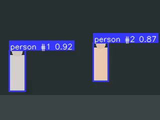

# 🎬 cv-evidence-renderer

The missing **evidence-clip layer** between your detector and storage. Trigger on any detection event → get a trimmed MP4 with bounding boxes already burned in, encoded by NVENC, in pure Python — no DeepStream required.



> Demo GIF placeholder: live RTSP feed, person enters zone, the recorder catches the 5 seconds *before* the trigger from its ring buffer, then records 10 seconds after — evidence MP4 lands on disk with bbox + label.

---

## Why this project

Every CV team shipping to production hits the same wall: the detector fires, and now you need a **short MP4 clip of the event with bounding boxes drawn on it**, to attach to an alert, archive for compliance, or replay during QA. The existing options are all incomplete:

- [`supervision`](https://github.com/roboflow/supervision) (39k ⭐) owns Python drawing — but its `VideoSink` is `cv2.VideoWriter` with `mp4v` hard-coded. No NVENC, no event window, no pre/post buffer.
- DeepStream's **Smart Record** is the official NVIDIA answer — but it has [no Python bindings](https://forums.developer.nvidia.com/t/how-to-use-smart-record-in-deepstream-6-1-python/231682) (NVIDIA staff confirmed), and bbox burn-in [has been broken since 6.4](https://forums.developer.nvidia.com/t/deepstream-6-4-smart-record-video-issue-with-bbox-enabled/290732).
- The canonical [PyImageSearch KeyClipWriter](https://pyimagesearch.com/2016/02/29/saving-key-event-video-clips-with-opencv/) ring-buffer pattern is detection-agnostic, OpenCV-only, and isn't a library.

So every team hand-rolls OpenCV + an FFmpeg subprocess, ships the bug to prod, and writes it again on the next project. This repo is the library version of that pattern — done once, done right, with GPU encoding included.

---

## What it does (and doesn't)

✅ **Does:**
- Event-window MP4 export with **configurable pre-buffer and post-buffer** seconds
- **Bounding-box / label burn-in** before encode (so the evidence file *is* the annotated version)
- **NVENC** (H.264 / H.265) on CUDA hosts, **libx264** fallback everywhere else
- Live mode: threaded RTSP reader → ring buffer → `trigger_event()` flushes evidence
- Offline mode: re-render evidence from saved video + detections JSONL
- Multi-stream parallel via shared encoder pool
- **First-class interop** with [`supervision.Detections`](https://supervision.roboflow.com/) — also accepts raw JSONL

🚫 **Does not (by design):**
- Detection / tracking — bring your own (YOLO, Detectron2, anything that produces bboxes)
- Live video streaming output — output is an MP4 file, not an RTSP relay
- Alerting / Telegram / email — pair with [realtime-object-detection-alert](https://github.com/ddinhcchi/realtime-object-detection-alert) for that
- Web UI — CLI + Python library only

---

## Quick start

```bash
pip install cv-evidence-renderer

# Optional: install with supervision interop
pip install cv-evidence-renderer[supervision]
```

### Use case A: live RTSP with event trigger

```python
from cv_evidence_renderer import EvidenceRecorder
import supervision as sv  # optional

recorder = EvidenceRecorder(
    source="rtsp://camera.local/stream",
    pre_buffer_seconds=5,
    post_buffer_seconds=10,
    encoder="nvenc_h264",        # auto-falls back to libx264 if no GPU
    output_dir="./evidence/",
)
recorder.start()

# In your detection loop:
for frame_idx, frame in your_video_reader:
    detections: sv.Detections = your_detector(frame)
    recorder.push(frame_idx, detections)

    if your_business_rule(detections):
        clip_path = recorder.trigger_event(
            event_id="violation_001",
            label="no_helmet zone A",
        )
        # → ./evidence/violation_001_20260524T143012.mp4
        # → 15s clip: 5s pre + trigger + 10s post, bbox burned in
```

### Use case B: offline batch from JSONL

```python
from cv_evidence_renderer import render_from_jsonl

render_from_jsonl(
    video="incidents/raw_001.mp4",
    detections_jsonl="incidents/raw_001.detections.jsonl",
    event_start=12.5,            # seconds
    event_end=22.0,
    output="evidence/event_001.mp4",
    encoder="nvenc_h264",
)
```

### Use case C: CLI

```bash
cv-evidence render \
  --input street.mp4 \
  --detections detections.jsonl \
  --event-start 12.5 --event-end 22.0 \
  --output evidence.mp4 \
  --encoder nvenc_h264

# Batch: one folder of video + one events.jsonl → N evidence files
cv-evidence batch \
  --inputs ./videos/ \
  --events events.jsonl \
  --output-dir ./evidence/ \
  --workers 4
```

---

## Benchmark — RTX 3060 vs Apple M4

15-second evidence clip @ 1080p, bbox burn-in on every frame (30fps), 5s pre + 10s post buffer. Reproduce with `python scripts/benchmark.py`.

> ⚠️ Benchmark numbers below are PLACEHOLDERS for the launch — to be filled in Week 4 with reproducible measurements on the actual hardware.

| Device | Encoder | Render time | Throughput | File size |
|---|---|---:|---:|---:|
| RTX 3060 | `nvenc_h264` | TBD | TBD | TBD |
| RTX 3060 | `libx264` | TBD | TBD | TBD |
| Apple M4 | `libx264` | TBD | TBD | TBD |
| CPU only | `libx264` | TBD | TBD | TBD |

---

## Architecture

```
                                ┌──────────────────────────────────────┐
                                │  Your detector loop                  │
                                │  (YOLO / Detectron2 / anything)      │
                                └──────────────┬───────────────────────┘
                                               │ frame_idx, sv.Detections
                                               ▼
┌──────────────┐    ┌──────────────────┐    ┌──────────────────┐    ┌──────────────┐
│ Video source │ → │ Threaded reader  │ → │ Ring buffer      │ → │ NVENC encoder│ → evidence.mp4
│ RTSP / MP4   │    │ (auto-reconnect) │    │ (pre-buffer N s) │    │ (PyAV)       │
└──────────────┘    └──────────────────┘    └────────▲─────────┘    └──────────────┘
                                                     │
                                          on trigger_event():
                                          flush pre-buffer +
                                          record N more seconds
                                          with bbox burn-in
```

### Code layout

| File | Responsibility |
|---|---|
| `src/cv_evidence_renderer/recorder.py` | `EvidenceRecorder` — live RTSP + ring buffer + trigger API |
| `src/cv_evidence_renderer/offline.py` | `render_from_jsonl()` — re-render from saved video |
| `src/cv_evidence_renderer/buffer.py` | Ring buffer with keyframe-aware seek |
| `src/cv_evidence_renderer/encoder/nvenc.py` | PyAV NVENC wrapper |
| `src/cv_evidence_renderer/encoder/libx264.py` | Fallback CPU encode |
| `src/cv_evidence_renderer/overlay.py` | Bbox burn-in (cv2; supervision-compatible) |
| `src/cv_evidence_renderer/io/rtsp.py` | Threaded RTSP reader, auto-reconnect |
| `src/cv_evidence_renderer/adapters.py` | `sv.Detections` ↔ internal format ↔ raw JSONL |
| `src/cv_evidence_renderer/pool.py` | Multi-stream encoder pool |
| `src/cv_evidence_renderer/cli.py` | Typer entrypoint |

---

## Design notes

- **Why a ring buffer instead of just trimming after the fact?** Because in live mode you don't *have* the future — when an event fires at frame N, you need to have already been keeping frames N-150 to N. A naive trim-after-event approach only works for saved video files (see "use case B"), and most teams hit the live case first.
- **Why bbox burn-in instead of metadata sidecar?** Evidence clips get sent to non-technical operators (compliance, ops) who open them in QuickTime / VLC. A sidecar JSON they can't read is useless. The burn-in is the point.
- **Why PyAV instead of `subprocess` to FFmpeg?** Race conditions when multiple streams write to the same FFmpeg subprocess pool. PyAV gives a clean Python object per stream and re-uses the libav encoder context.
- **Why interop with supervision instead of re-implementing drawing?** Because supervision (39.5k ⭐) does it better than we ever will, and "ride the ecosystem" is faster than "compete for drawing API mindshare". Our moat is the event-clip pipeline, not the rectangle drawing.
- **Why keyframe-aware seek for pre-buffer?** Because seeking to a non-keyframe in libav gives you garbage frames until the next IDR. The buffer indexes keyframes and snaps pre-buffer start to the nearest one.

---

## Roadmap

- DeepStream sink integration (close the [no-Python-binding](https://forums.developer.nvidia.com/t/how-to-use-smart-record-in-deepstream-6-1-python/231682) gap)
- Overlapping recordings on the same stream ([feature DeepStream explicitly doesn't support](https://forums.developer.nvidia.com/t/need-parallel-overlap-recording-on-the-same-stream/337137))
- Per-event metadata sidecar (JSON + MKV chapters)
- ONVIF event trigger input

---

## Comparison to similar tools

See [COMPETITORS.md](COMPETITORS.md) for the full research write-up.

| | cv-evidence-renderer | supervision | DeepStream Smart Record | KeyClipWriter |
|---|---|---|---|---|
| Python-only install | ✅ | ✅ | ❌ (needs DeepStream SDK) | ✅ |
| NVENC encode | ✅ | ❌ | ✅ | ❌ |
| Event-window trim with pre-buffer | ✅ | ❌ | ✅ (C only) | ✅ |
| Bbox burn-in | ✅ | ✅ (excellent) | ⚠️ (bug since 6.4) | ❌ |
| Multi-stream pool | ✅ | ❌ | ✅ | ❌ |
| supervision interop | ✅ | — | ❌ | ❌ |

---

## License

MIT
